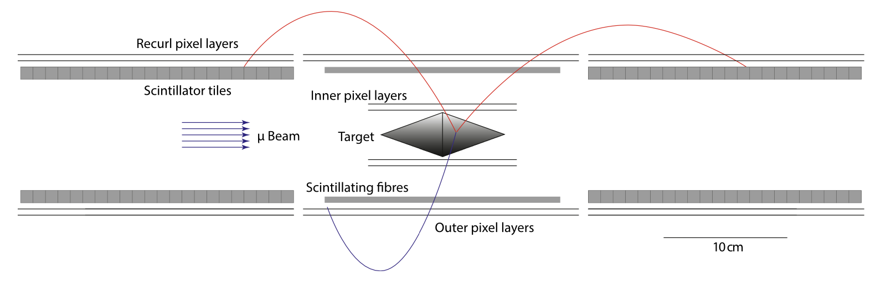
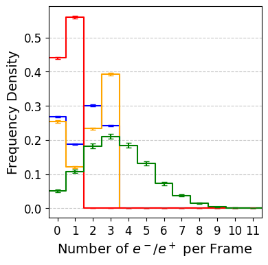
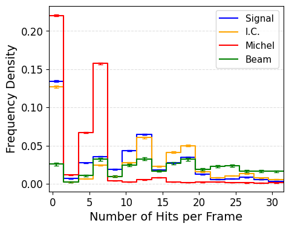
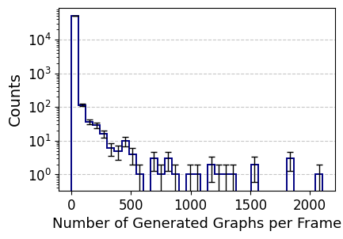

# Graph Neural Networks for Track Finding in Mu3e
> **Dan King**  
> Supervisor: Nikolaos Rompotis

This repository contains the full process of developing a Graph Neural Network (GNN) model for the Mu3e experiment.

The Mu3e experiment at the Paul Scherrer Institute searches for the charged-lepton-flavour-violating decay μ⁺ → e⁺ e⁺ e⁻ (signal) with the goal of excluding branching fractions above \(10^-16\) at the 90% confidence level. This decay is essentially forbidden by the Standard Model (SM) and any observation would provide evidence of new physics. The challenge faced by Mu3e software is a loss in the number of signal decays seen (i.e. a low efficiency) when applying algorithms that purify signal detection. An alternative approach with a Graph Neural Network (GNN) finds efficiencies similar to the official standard reconstruction algorithm. However, due to the sensitivity of the experiment, the GNN purity of 94.5\% (i.e. ~5% of predictions are not true electrons) on the beam simulation currently does not allow confident observation if tracks were to be combined into single decay vertices. More information on the experiment is available in the [Technical design of the phase I Mu3e experiment](https://arxiv.org/abs/2009.11690).

  

Monte Carlo simulations accurately model the expected decay particles' hits left in the detector. The Graph Neural Network approach outlined in this repository focuses on six-hit tracks that reach the recurl pixel layers. A three-class GNN uses spatial and kinematic information of combinations of hits left in the detector to classify each six-hit graph as an electron, positron, or fake (combinatorial background). Common background decay types are internal conversion μ⁺ → e⁺ e⁺ e⁻ νe ν̄μ and Michel μ⁺ → e⁺ νe ν̄μ. 

  
  

A cheap constraints algorithm for graph generation greatly reduces processing time, essentially focusing on graphs that appear the most similar to real particle tracks. 

  

The GNN model is trained and validated on a dataset of ~92,000 six-hit graphs of one signal decay event per frame, where a frame is a period of time long enough to capture all hits from the decay. In the beam simulation, at most one signal decay is expected to be seen among the background decays.