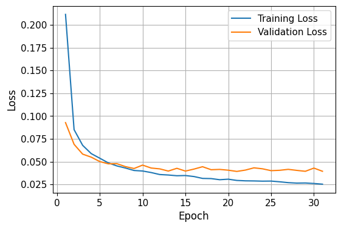
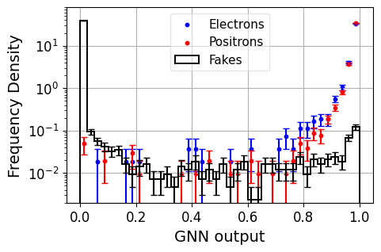
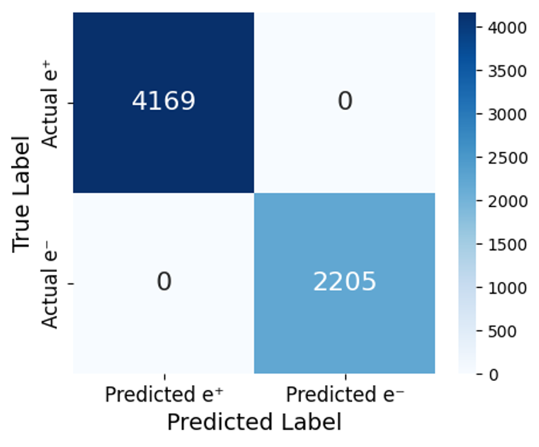
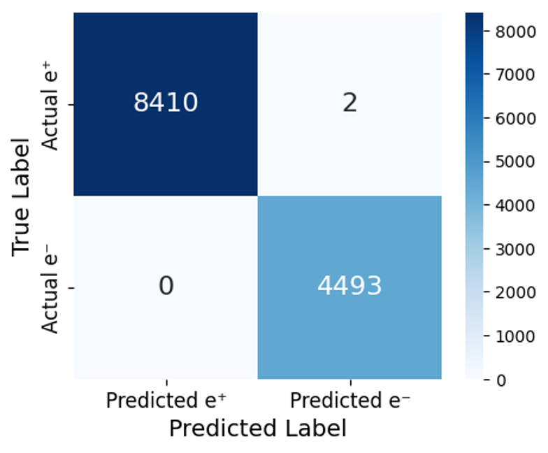
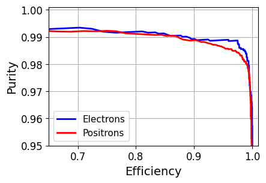
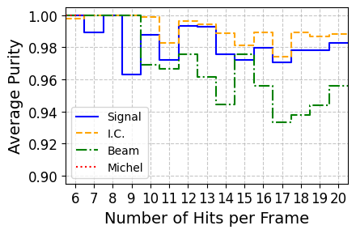
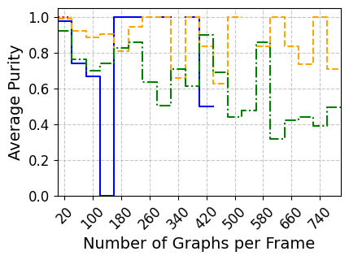
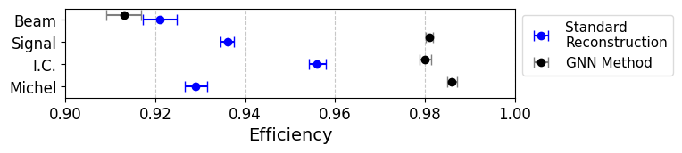

# Graph Neural Networks for Track Finding in Mu3e
> **Dan King**  

The Mu3e experiment at the Paul Scherrer Institute searches for the charged-lepton-flavour-violating decay μ⁺ → e⁺ e⁺ e⁻ (signal) with the goal of excluding branching fractions above \(10^-16\) at the 90% confidence level. This decay is essentially forbidden by the Standard Model (SM) and any observation would provide evidence of new physics. The challenge faced by Mu3e software is a loss in the number of signal decays seen (i.e. a low efficiency) when applying algorithms that purify signal detection. An alternative approach with a Graph Neural Network (GNN) finds efficiencies similar to the official standard reconstruction algorithm. However, due to the sensitivity of the experiment, the GNN purity of 94.5\% (i.e. ~5% of predictions are not true electrons) on the beam simulation currently does not allow confident observation if tracks were to be combined into single decay vertices. More information on the experiment is available in the [Technical design of the phase I Mu3e experiment](https://arxiv.org/abs/2009.11690).

  

This repository contains the full process of developing a Graph Neural Network (GNN) model for the Mu3e experiment:

- Implements a six‐hit graph-building procedure with loose geometric and kinematic constraints, pruning away most combinatorial (fake) graphs.
- Defines and trains a three-class GNN (electron vs. positron vs. fake) using PyTorch Geometric, including custom message-passing layers, batch-norm, pooling, and truth data concatenation.

- Includes routines for:
  - Loading Mu3e MC hits (via uproot) and constructing node/edge/global features for each six‐hit candidate graph.
  - Normalising all graph features using global means/σ from the signal set.
  - Splitting into train/val/test, early-stopping on validation loss, and saving the best model.

- Provides evaluation code to:
  - Compute per-class ROC/AUC, purity, efficiency, and Clopper–Pearson errors.
  - Deduplicate true (real) graphs due to overlapping Mu3e detection ladders.
  - Perform greedy overlap-removal (hit-sharing) among predicted real graphs to improve purity at the cost of efficiency.

- Helper scripts:
  - Creating Pandas DataFrames from deduplicated graphs (with model predictions and all truth/feature columns) for downstream analysis.
  - Plotting (with Poisson error bars) confidence histograms, purity and efficiency vs. truth info and hit-counts per frame.

## Report overview:

Monte Carlo simulations accurately model the expected decay particles' hits left in the detector, made up of frames: a period of time long enough to capture all hits from the decay. The Graph Neural Network approach outlined in this repository focuses on six-hit tracks that reach the recurl pixel layers. A three-class GNN uses spatial and kinematic information of combinations of hits left in the detector to classify each six-hit graph as an electron, positron, or fake (combinatorial background). Common background decay types are internal conversion μ⁺ → e⁺ e⁺ e⁻ νe ν̄μ and Michel μ⁺ → e⁺ νe ν̄μ. 

  
  

A cheap constraints algorithm for graph generation greatly reduces processing time, essentially focusing on graphs that closely resemble true particle tracks. 

  

The GNN model is trained and validated on a dataset of ~92,000 six-hit graphs of one signal decay event per frame. In the beam simulation, at most one signal decay is expected to be seen in a frame among the background decays.

  

The model returns outputs for each class on test graphs (for signal, this is 20% of the available set). The outputs are the model's estimated probabilities of the graph belonging to each class. In some cases, the model will incorrectly give true electron and positron graphs low outputs and vice versa. Note that the y axis is logarithmic.

  

The model rarely misclassifies electrons as positrons, and vice versa.

  
  

There is a trade-off between purity and efficiency. More real and fake graphs are classified real as the required score to pass is lowered. This increases efficiency (more of the true real graphs are correctly recalled), but lowers purity (more fakes are among the real predictions).

  

For frames with more hits, the model's performance is worse as there is higher chance of nearby hits generating fakes that closely resemble real tracks. For frames with equal hits, the beam set tends to have worse purity due to individual Michel decays with uniform spatial distribution as opposed to for example signal requiring all electrons to conserve momentum. 

  
  

Comparing the full GNN method efficiencies for all datasets with the official standard reconstruction.

  

